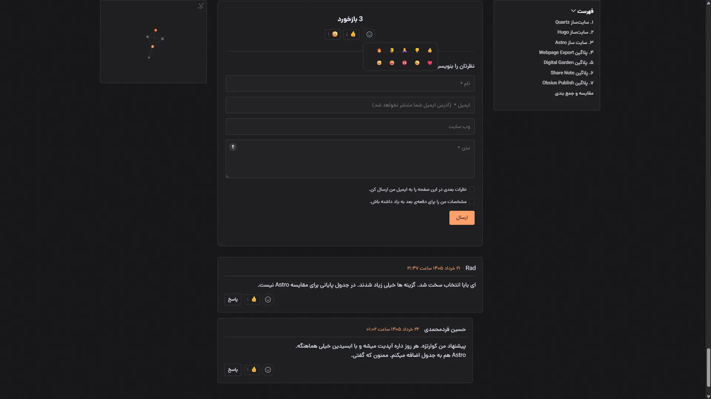

English | [فارسی](https://github.com/fardm/standalone-comments-server/blob/main/README-fa.md)

# Quartz Standalone Comments

This project adds a commenting system to [Quartz](https://quartz.jzhao.xyz/). The original repository can be found here: https://github.com/dlnorman/standalone-comments.

 I made several modifications to improve compatibility and usability for Quartz websites.

 > ✅ Compatible with Quartz v5

## Features



- 🌍 Multilingual support (English & Persian, extendable via i18n)
- 😀 Reactions with 10 emoji options for both posts and comments
- 👤 Gravatar integration with automatic fallback avatars
- 💬 Latest comments widget
- 🛠️ Admin panel for viewing and managing comments
- 📦 Data import and export support
- 🛡️ Spam protection and moderation system
- 📧 Email notifications for new comments

<br>

## Installation

> ⚠️ It is recommended to use PHP 8.0 or newer. Although the original project claims support for PHP 7.4, I encountered errors with PHP 8.1. The issues were resolved after upgrading to PHP 8.3.

### Step 1: Install on Your Server

1. Get a shared hosting account and create a subdomain, for example: `comments.yourdomain.com`.
2. Download this repository by clicking the green **Code** button and selecting **Download ZIP**.
3. Upload the ZIP file to your hosting account's `public_html` directory and extract it.
4. Edit the `config.php` file:
   - Set `APP_URL` to the subdomain where you uploaded the files, for example: `https://comments.yourdomain.com`  
   - Set `ALLOWED_ORIGINS` to your Quartz website domain, for example: `https://yourdomain.com`  
   - Set `APP_LANGUAGE` to choose the frontend language (`en` or `fa`)
5. Open `set-password.php` in your browser:

   ```
   https://comments.yourdomain.com/set-password.php
   ```

6. Choose an admin password.
7. Open the admin panel:

   ```
   https://comments.yourdomain.com/admin.html
   ```

8. Enter the password you selected and log in.

After successfully logging in, delete the `set-password.php` file from your `public_html` directory.

### Step 2: Install the Quartz Plugin

Run the following command inside your Quartz project:

```bash
npx quartz plugin add github:fardm/quartz-standalone-comments
```

Once installed, open the `quartz.config.yaml` file and configure the plugin. Set `backendUrl` to the URL of the server where you uploaded the comment system:

```yaml
- source: github:fardm/quartz-standalone-comments
  enabled: true
  options:
    backendUrl: https://comments.yourdomain.com
  layout:
    position: afterBody
    priority: 100
```

Start the local preview server:

```bash
npx quartz build --serve
```

You should now see the comment section at the bottom of your pages.

Keep in mind that this is only a local preview. Since the site is running locally, reactions and comments will not be stored in the database.

Deploy and sync your site using:

```bash
npx quartz sync
```

After deployment, visit your website and test both comments and reactions.

<br>

## Recent Comments Widget

To display the latest comments in your sidebar or any other part of your site's layout, simply add the following configuration to your `quartz.config.yaml` file:

```yaml
- source: github:fardm/quartz-standalone-comments
  enabled: true
  options:
    backendUrl: [https://comments.yourdomain.com](https://comments.yourdomain.com)
    type: recent
    limit: 5
  layout:
    position: right
    priority: 50
```

<br>

## Enable Email Notifications

Email notifications require a cron job. If you installed the system on a subdomain (recommended), use the correct absolute path from your hosting provider.

1. Create a new Cron Job in your hosting panel  
2. Paste the following command:
```
/usr/local/bin/php /home/username/domains/comments.example.com/public_html/utils/process-email-queue.php
```
3. Go to **Utilities** and enable **Email Notifications**  
4. Enter your email address in the **Admin Email** field and save the settings  
5. Create a few test comments to verify everything is working correctly

<br>

## My Modifications

Summary of the changes I made to the original project:

- Added language configuration support for the frontend (i18n-ready setup).
- Jalali (Persian) date support
- Added comment sorting controls in the admin panel.
- Refactored import/export system to include all data types (comments, reactions, subscriptions, and spam).
- Added a one-click database cleanup feature with selectable data categories.
- Improved styling and UI
- Dark mode for the admin panel
- Redesigned emoji reactions (the original version only included four Disqus-style reactions; this version provides a wider GitHub-style emoji selection)
- Formatting help displayed inside the comment editor
- Added Gravatar support with automatic fallback avatars.

<br>

## Security

To reduce spam and abuse, the system includes several protection layers:

- Honeypot protection to detect and block bots
- Rate limiting
- Automatic IP blocking after multiple failed login attempts in the admin panel

<br>

## Future Improvements

- [ ] Refactor `api.php` into smaller modules (comments, reactions, subscriptions, settings, import/export) to improve maintainability.
- [ ] Create a shared admin layout/navigation component to remove duplicated HTML across admin pages.
- [ ] Reorganize `utils/` into structured subfolders (imports, migrations, maintenance) for better clarity.